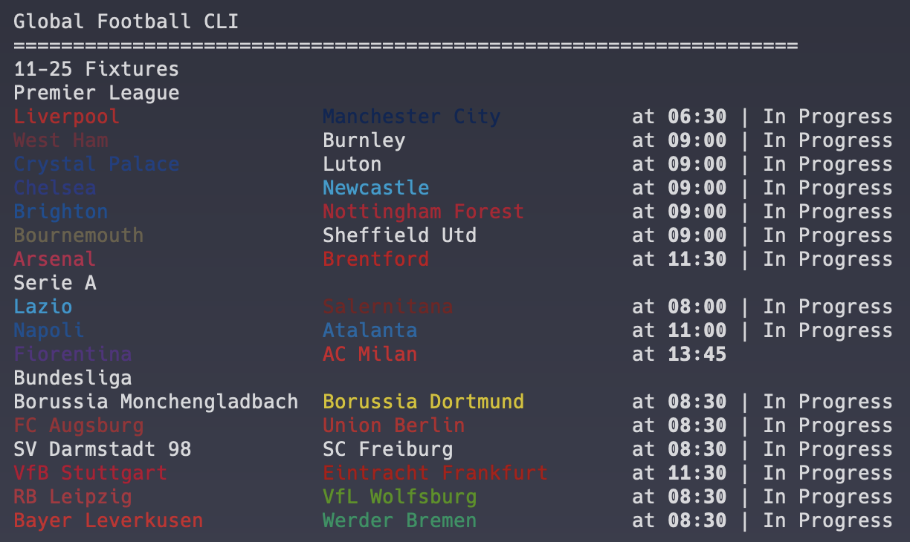
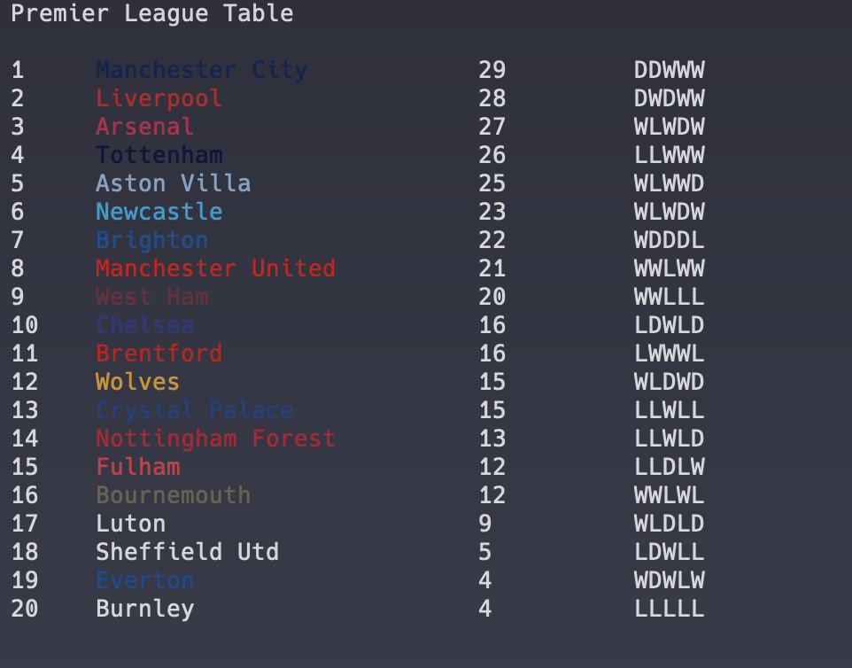

---

## A CLI application written in rust for football fans

 

:::: {style="display: flex;"}

::: {style="padding: 25px;"}
### Objectives
- #### learn rust
- #### make checking football scores easier and quicker
- #### create a tool I'll actually use

   
See [my repo](https://github.com/jopieji/footy) to get it for yourself!
:::

::: {style="padding: 25px;"}
{width=300}
  
{width=300}
:::

::::

