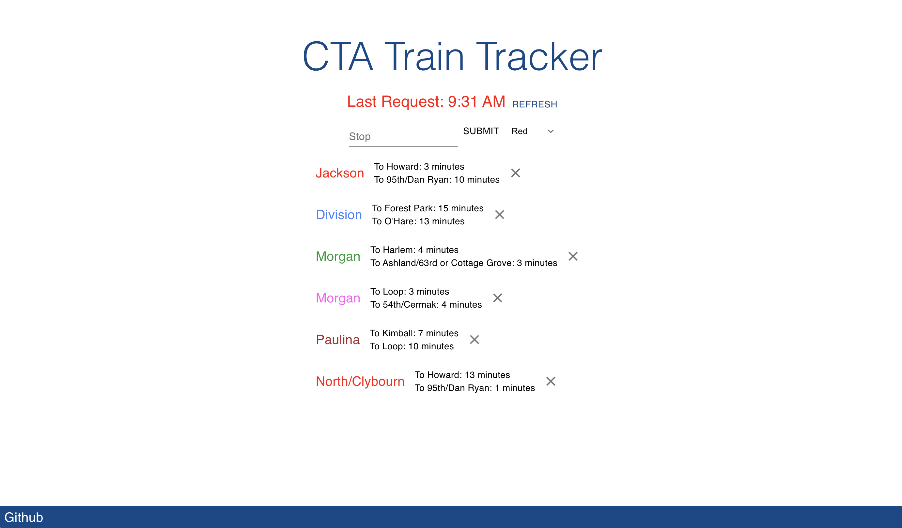

---
## A web app to check train arrival times

 

:::: {style="display: flex;"}

::: {style="padding: 25px;"}
### Objectives
- #### provide a tool to check train arrivals when leaving class
- #### practice react
- #### test deployments with vercel

   
See [my repo](https://github.com/jopieji/cta-react) or [the site](https://cta-react.vercel.app/) to learn more!
:::

::: {style="padding: 25px;"}
{width=400}
:::

::::