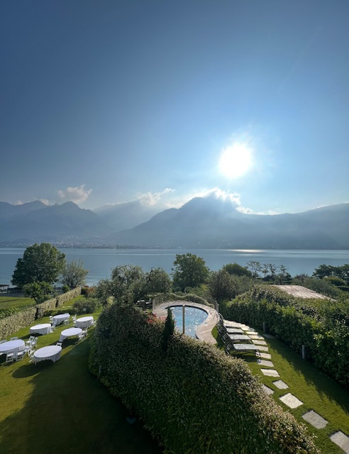
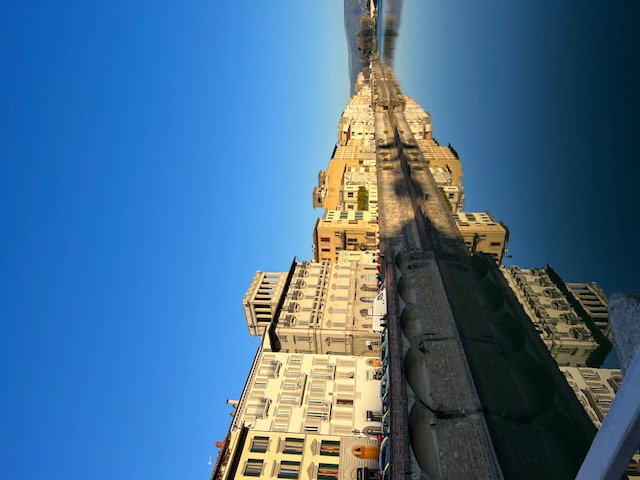
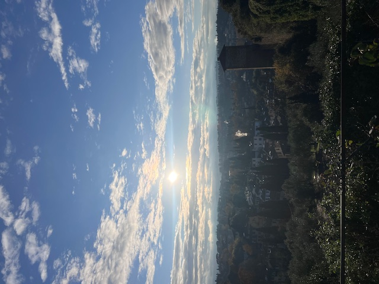
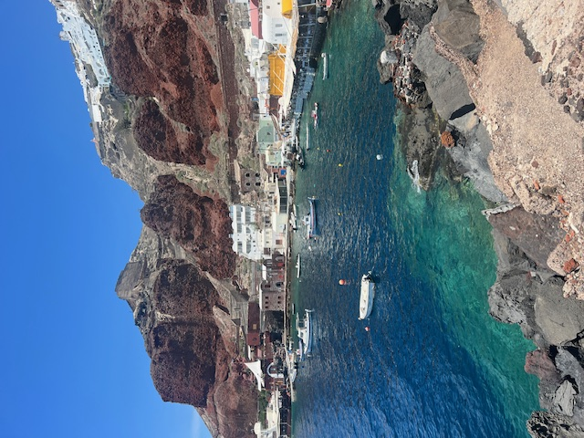

--- 

 

## Where I've been lately

### 2023

- #### Tampa, Florida
- #### Brooklyn, New York
- #### Athens, Greece
- #### Santorini, Greece

- #### Lake Como, Italy
- #### Squam Lake, New Hampshire
- #### Rome, Italy
- #### Florence, Italy

  

  
  
Lake Como, near Onno

  
  
Florence, Arno River

  
  
Florence, Boboli Gardens

  
  
Santorini, Amoudi Bay

